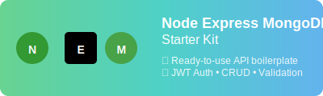

<div align="center">
  
</div>

# Node Express MongoDB Starter Kit

Welcome to a robust starter kit for building scalable RESTful APIs using Node.js, Express, and MongoDB. This project is designed for rapid development, best practices, and easy extensibility.

## Features
**Key Features:**
- Modern user authentication with JWT
- Role-based access control
- Full CRUD operations for resources
- Input validation and centralized error handling
- Flexible environment configuration
- Comprehensive unit and integration tests (Jest & Supertest)

## Prerequisites
**Requirements:**
- Node.js (v14 or higher)
- MongoDB (local or cloud instance)
- npm or yarn
- Postman or similar API testing tool (optional)
- Git (optional)
- Docker (optional)

## Installation
1. **Clone the repository:**
   ```bash
   git clone https://github.com/jmrashed/node-express-mongodb-starter-kit.git
   ```
2. **Navigate to the project directory:**
   ```bash
   cd node-express-mongodb-starter-kit
   ```
3. **Install dependencies:**
   ```bash
   npm install
   ```
4. **Configure environment:**
   ```bash
   cp .env.example .env
   ```
5. **Start the development server:**
   ```bash
   npm run dev
   ```

The server will be running at [http://localhost:3000](http://localhost:3000).
## Configuration
Update the `.env` file with your settings:
```env
PORT=3000
MONGODB_URI=mongodb://localhost:27017/your-database
JWT_SECRET=your_jwt_secret
```
## Usage
Use Postman or any API testing tool to interact with the API endpoints. Refer to the API documentation for available endpoints and usage details.
## Testing
Run all unit and integration tests:
```bash
npm test
```
Tests are powered by Jest and Supertest for reliability and coverage.
## Docker
To run the application in Docker:
1. **Build the Docker image:**
   ```bash
   docker build -t node-express-mongodb-starter-kit .
   ```
2. **Run the Docker container:**
   ```bash
   docker run -p 3000:3000 --env-file .env node-express-mongodb-starter-kit
   ```
The server will be accessible at [http://localhost:3000](http://localhost:3000).

## Contributing
**Seeking Contributors!**

I am actively seeking contributors to help improve and maintain this project. Whether you are a beginner or an experienced developer, your input is valuable!

Ways to contribute:
- Suggest new features or improvements
- Report bugs or issues
- Submit pull requests
- Improve documentation

Please open an issue or submit a pull request for any enhancements, bug fixes, or questions. Let's build something great together!

## License
This project is licensed under the MIT License. See the [LICENSE](LICENSE) file for details.

## Acknowledgements
**Built With:**
- [Express](https://expressjs.com/) – Fast, minimalist web framework for Node.js
- [MongoDB](https://www.mongodb.com/) – NoSQL database for modern applications
- [Mongoose](https://mongoosejs.com/) – MongoDB object modeling for Node.js
- [jsonwebtoken](https://github.com/auth0/node-jsonwebtoken) – JWT implementation
- [Jest](https://jestjs.io/) – JavaScript testing framework
- [Supertest](https://github.com/visionmedia/supertest) – HTTP server testing library

## Contact
For questions or support, contact [jmrashed@gmail.com](mailto:jmrashed@gmail.com).


## Author
**Author:**
- [Jm Rashed](https://github.com/jmrashed)
- [GitHub Repository](https://github.com/jmrashed/node-express-mongodb-starter-kit)
- [LinkedIn Profile](https://www.linkedin.com/in/jmrashed/)
- [Portfolio](https://jmrashed.github.com)